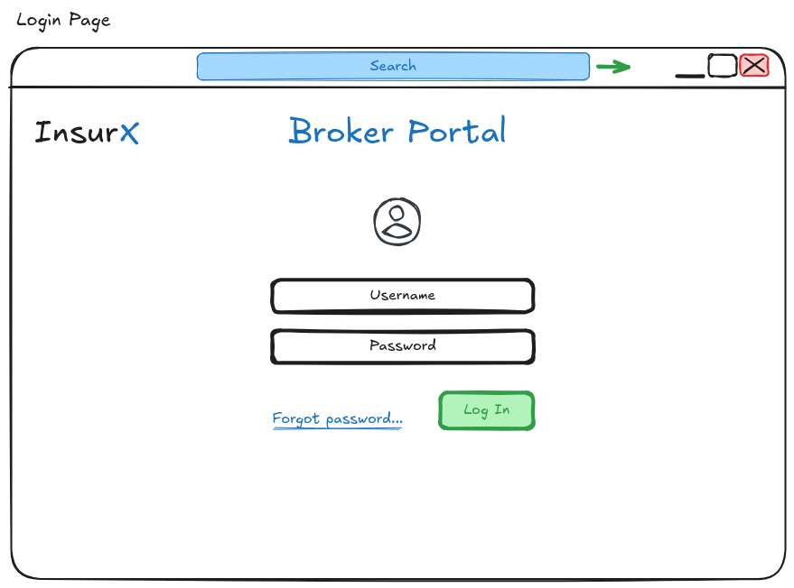
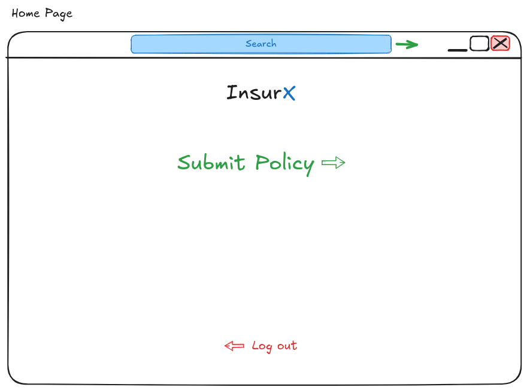
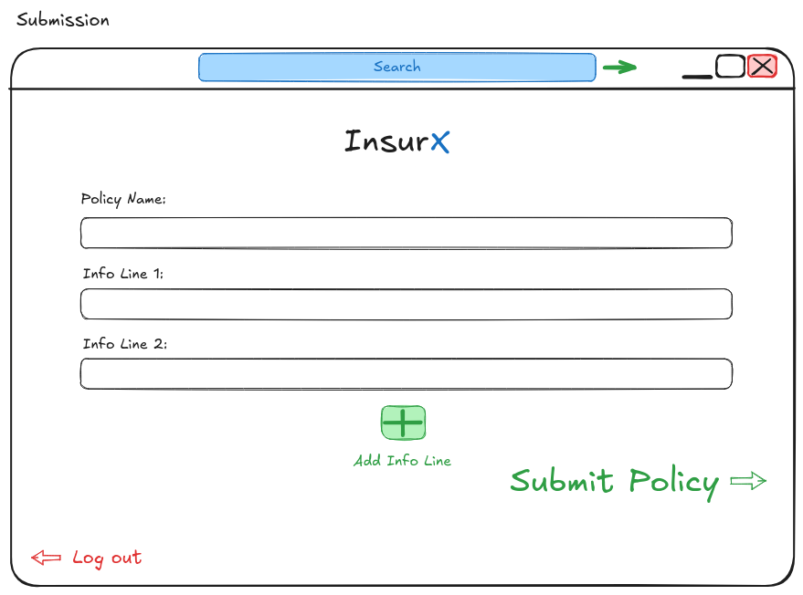

# Broker Portal

## Scenario

We're looking to build out our Broker Portal, a place where our brokers can submit policies to be in-scoped (fancy word for assessed).

Please review the designs below for reference to build against:

## The Task

Spend as much time as you would like covering the following:

    1. Implement a basic implementation of the design (the repo includes React, but feel free to switch out if you would prefer)
    2. Interface with the provided API

Things to remember:

    - Use what you deem to be good practice
    - Remember good security principles
    - You don't need to go over the top, good enough is better than perfect
    - This will form the first part of your 2nd stage interview where we'll be discussing and improving what you've done

## Design

Notes: should just use the API for login details, doesn't need any user registration. Should remain incredibly simple

Notes: doesn't need any over engineering, there needs to be a place for more navigation - Submitting a policy won't be the only link, we'll add something later. Feel free to improve on this page as long as brokers can easily identify a way to move forward to submissions.

Notes: The add button should add more info lines that brokers can fill out with things like "Property contains $200,000 of contents that need to be covered", "Property resides near a motorway" etc... It would be good for the brokers to be able to put in the total insurable limit, which should just be a field next to the policy name that is a currency ($20,000,000 or $15,000,000)

## General Info

How you achieve these task is down to you, the libraries you want to use, the components you use - you have full reign to show off your skills. Just remember that in our industry, products are never done and that there's always more to do - be cognicent of this as it can be a great discussion point.

Imagine you're in a newly formed product team and treat this like you're getting an MVP out with a some what healthy deadline - what techniques, practices and decisions will you make?

## API Info

[Read the docs](./apps/broker-portal-api/README.md)

## UI Info

[Read the docs](./apps/broker-portal-ui/README.md)
